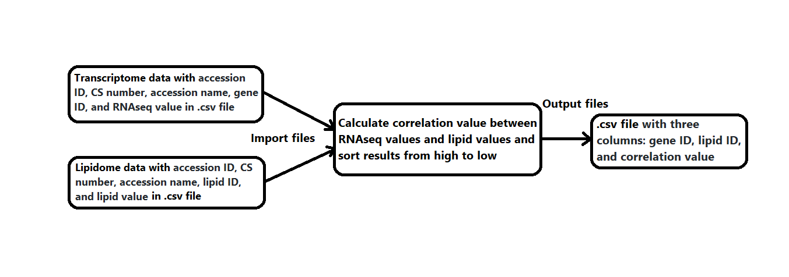

# Calculating correlations between transcriptome and lipidome in Arabidopsis

**Name**: Yu Song  
**Semester**: Spring 2020  
**Project area**: Biochemistry

## Objective
Write a python function to automate the calculation of correlation value from transcriptome data and lipidome data for a specific gene and a specific lipid molecular species in Arabidopsis.

## Outcomes
The input file is a csv. file with seven columns – accession ID, CS number, accession name, gene ID, lipid ID, RNAseq value, and lipid value. 
The output file is a .csv file with three columns: gene ID, lipid ID, and correlation level.

## Rationale
*Arabidopsis thaliana* is an excellent model to study genetic, cellular, and molecular biology of plants because of its small genome size, well-sequenced genomes. Genome wide association studies (GWAS) is a powerful tool to dissect the genetic architecture of complex traits in plant. Our previous GWAS analysis based on lipidomic data of 360 natural Arabidopsis accessions revealed some candidate genes along with causative SNPs for lipid metabolism. Some SNPs are located in intron or intergenic region which may influence the gene expression level. We know there are some associations between transcriptome variation and lipid variation in natural Arabidopsis accessions. Kawakatsu et al. analyzed the transcriptomes from 727 accessions grown at 22°C. Recently we analyzed the lipidomes from 360 accessions also grown at the same condition. We hypothesized that with high correlation value calculated from RNAseq values of specific gene and lipid values, it is possible the gene is responsible for lipid metabolism. Strong correlations between transcriptome and lipidome provide more evidence to confirm the candidate genes identified by GWAS.

## Sketch

## References
Kawakatsu, Taiji, et al. "Epigenomic diversity in a global collection of Arabidopsis thaliana accessions." *Cell* 166.2 (2016): 492-505.
